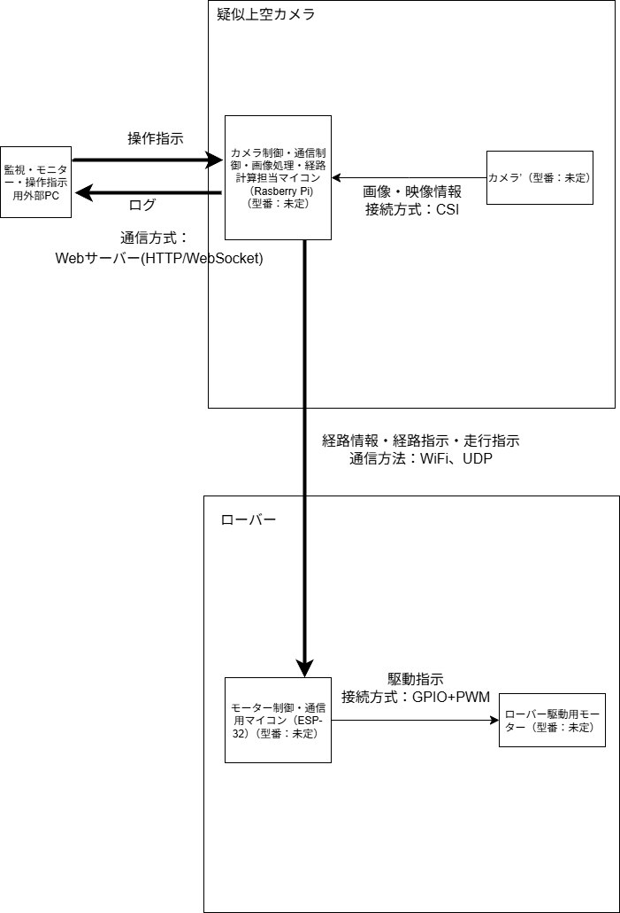

# 疑似上空カメラを用いた自律走行ローバーシステム
**Status**: 🏗️ In Development (Phase: Design & Procurement)

## プロジェクト概要
Raspberry Pi 4（画像処理・サーバー）とESP32（モーター制御）を連携させ、上空からのカメラ映像を元に迷路を自律走行するロボットシステムです。
Web技術と組み込み開発の統合、およびリアルタイムなフィードバック制御の実装を目的としています。

### 目的
* 未経験からの組み込み・IoTシステム開発スキルの習得
* 独立したデバイス間でのネットワーク通信（UDP）と分散処理の実装
* 画像認識によるクローズドループ制御（フィードバック制御）の実現

## システムアーキテクチャ（設計）
本システムは、 **「頭脳（Raspberry Pi）」** と **「足（ESP32）」** をWi-Fiネットワーク経由で分離した構成をとっています。

### 処理フロー
1.  **Sensing**: Raspberry Pi (+Camera Module 3) が迷路全体を俯瞰撮影。
2.  **Processing**: OpenCVを用いてローバーの位置（マーカー）を特定し、A*アルゴリズムで最適経路を算出。
3.  **Command**: 次にとるべき行動（旋回・前進）を算出・JSON化し、UDPで送信。
4.  **Actuation**: ESP32がパケットを受信し、FreeRTOSのタスク管理下でモーターをPWM制御。

* システム構成図

## 技術スタック（選定技術）

| カテゴリ | 技術・選定部品 | 選定理由 |
| :--- | :--- | :--- |
| **Main Controller** | **Raspberry Pi 4 Model B (4GB)** | OpenCVによる画像処理負荷とWebサーバーの並行稼働に耐えうる処理能力が必要なため。 |
| **Sub Controller** | **ESP32-DevKitC** | リアルタイム性が求められるモーター制御を、OS（Linux）から切り離してRTOS上で実行するため。 |
| **Camera** | **Pi Camera Module 3** | オートフォーカス機能により、設置高さ（約1m）からの鮮明なマーカー認識を行うため。 |
| **Language** | **Python 3, C++** | Pi側の豊富なライブラリ活用(Python)と、ESP32側の厳密なハードウェア制御(C++)の使い分け。 |
| **OS / Framework** | **Raspberry Pi OS, FreeRTOS** | マルチタスク・マルチスレッド処理による非同期制御の実装。 |
| **Network** | **UDP / Wi-Fi** | 低遅延な指令送信を実現するため、TCPではなくオーバーヘッドの少ないUDPを採用。 |

##  開発ロードマップと進捗

- [x] **要件定義・基本設計**
    - システム全体のアーキテクチャ策定
    - 制御ループ（Open Loop vs Closed Loop）の比較検討と決定
- [x] **ハードウェア選定**
    - 電源周りの電圧降下対策（3A出力要件）の検討
    - 筐体設計（タミヤパーツを用いた二階建て構造）
- [ ] **環境構築** 👈 Now!
    - Raspberry Pi OSセットアップ / OpenCV導入
    - ESP32開発環境（Arduino IDE）構築
- [ ] **プロトタイプ実装**
    - Lチカ、モーター駆動テスト
    - カメラ映像の取得と画像処理テスト
- [ ] **システム統合・走行試験**

## 工夫点・こだわり（設計思想）
**「オープンループ制御」から「クローズドループ制御」への転換**
当初は経路を事前計算して一括送信する設計でしたが、タイヤの空転やモーター個体差による「現実世界の誤差」を考慮し、カメラ映像で常に位置補正を行うフィードバック制御方式を採用しました。

## 詳細ドキュメント (Documentation)
本プロジェクトの設計資料は `docs` ディレクトリにて公開しています。

* **[要件定義書](./docs/01_requirements.md)**
    * 機能要件・非機能要件 / ユースケース / 制約条件
* **[基本設計成果物](./docs/02_basic_design.md)**
    * システム構成図 / ソフトウェア構成図 / 通信プロトコル仕様 (UDP/WebSocket)
* **[詳細設計成果物](./docs/03_detailed_design.md)**
    * タスク構成図 (FreeRTOS) / モジュール詳細設計 / 処理ロジックフローチャート
---

*Author: [tkudo] / Last Updated: 2025-12-1*