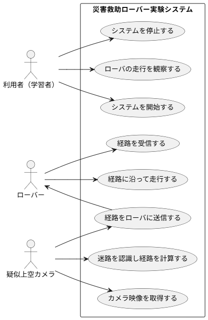

# プロジェクト概要・要件定義書

# **1. プロジェクト概要**

本プロジェクトは、災害救助を想定したローバーシステムの初歩実装を目的とする。迷路を地上に設置し、上空からRaspberry Pi搭載カメラで取得した画像を処理し、その経路情報をESP32搭載のローバーに送信することで、自律走行を実現する。

# **2. 要件定義**

## **2.1 背景・目的**

災害現場などにおけるロボット遠隔制御技術の基礎研究として、遠隔画像処理と組み込み制御を組み合わせたシステムを実装する。

## **2.2 対象ユーザー**

・災害救助ロボット技術に関心を持つ研究者・開発者

・組み込みシステム開発に携わるエンジニア志望者

・教育機関における教材利用

## **2.3 機能要件**

### FR-01 上空映像取得

- システムは疑似上空カメラ（Raspberry Pi）を用いて迷路全体を撮影できること。

### FR-02 経路認識・計算

- システムは取得した映像を処理し、迷路のラインを認識して最適な経路を計算できること。

### FR-03 経路送信

- システムは計算した経路データをローバーに送信できること。

### FR-04 経路受信

- ローバー（ESP32）は疑似上空カメラから送られた経路データを受信・保持できること。

### FR-05 経路走行

- ローバーは受信した経路データに従い、自律的に迷路を走行できること。

### FR-06 システム開始

- 利用者はシステムを起動し、ローバーと疑似上空カメラを動作可能状態にできること。

### FR-07 システム停止

- 利用者はシステムを安全に停止できること。

### FR-08 観察

- 利用者は、PC上の画面で疑似上空カメラが撮影している映像と、認識した経路をリアルタイムで確認できること。

## **2.4 非機能要件**

### NFR-01 処理性能

- 経路計算および通信は 150ms 以内で応答すること。

### NFR-02 精度

- ローバーの走行誤差は ±15mm 以内であること。

### NFR-03 信頼性

- 通信エラーが発生した場合、システムは自動的に再送または再試行を行うこと。
- ローバーはデータ受信失敗時に待機状態へ移行すること。

### NFR-04 安定性

- システムは1時間以上の連続稼働に耐えること。

### NFR-05 拡張性

- 経路探索アルゴリズムはモジュール化されており、設定ファイルを変更するだけでA*アルゴリズムとダイクストラ法を切り替えられること

### NFR-06 操作性

- システムの起動・停止操作は利用者が直感的に行えること。

### NFR-07 安全性

- ローバーは走行中に障害物を検知した場合、安全に停止または回避行動に移行すること。
- ローバーは、前方5cm以内に障害物を検知した場合、0.1秒以内にモーターへの電力を遮断すること
- ※回避行動は拡張機能と考えている（2025年9月4日）

## 2.5ユースケース

- 全体

- ローバー

- 疑似ドローン

## **2.5 使用技術**

・Raspberry Pi + カメラモジュール

・ESP32（FreeRTOS + C言語）

・OpenCV（画像処理）

・UDP通信

・Python / C言語

### 2.6制約条件

### C-01　コスト

- 本プロジェクトで使用するハードウェア部品の総費用は、**15,000円以内**とする。
- 要求仕様を満たす同等の性能を持つ部品が複数存在する場合、安定供給とコストパフォーマンスを考慮し、最も合理的なものを採用する

### C-02　センサー

- 本プロジェクトで修正・改善が行われたとしても、ローバーへのセンサーの搭載は行わないものとする